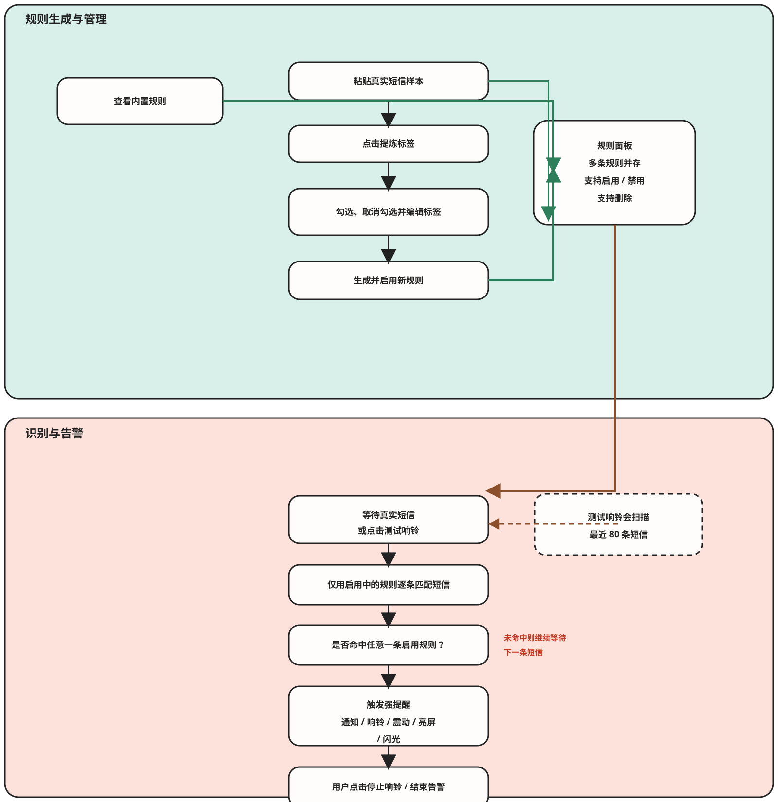

# 挪车提醒

一个面向 Android 的违停挪车短信强提醒应用。  
当短信命中启用中的规则后，应用会立即触发前台告警、循环响铃、震动、亮屏、全屏提醒和闪光灯爆闪，尽量减少错过挪车通知的情况。

## 当前定位

- 默认内置 1 条上海交警违停短信规则
- 支持用户粘贴任意城市或单位的真实短信样本，现场提炼标签并生成本地规则
- 规则可单独启用、禁用、删除，内置上海规则也允许删除
- 多条规则同时存在时，生效逻辑是“并集”
  只要任意一条启用规则命中短信，就会触发提醒

## 功能特性

- 监听短信广播并实时识别疑似违停短信
- 首次进入自动弹出核心权限申请
- 支持从短信样本中提炼多个候选标签
- 标签支持勾选、取消勾选和直接编辑后再生成规则
- 规则列表支持多条展示、单条启用/禁用、单条删除
- 支持“真实测试响铃”
  自动扫描最近短信，找到命中当前启用规则的短信后直接触发告警
- 支持手动停止当前告警

## 使用流程图



## 规则系统

### 1. 内置规则

当前默认仅内置上海样本，规则内容基于这类短信：

> 【上海交警】您的小型新能源汽车沪BA63671于2026年5月12日10时42分在亮景路进博云路南约37米未按规定停放已被记录，请立即驶离，未及时驶离的，将依法予以处罚。

对应实现见：

- [SmsRuleRepository.kt](app/src/main/java/com/example/parkingalert/SmsRuleRepository.kt)

### 2. 自定义规则生成

生成流程：

1. 在首页点击“上传短信样本，生成新规则”
2. 粘贴原始短信内容
3. 点击“提炼标签”
4. 在候选标签里勾选需要的规则项，可直接编辑文本
5. 点击“生成规则”

说明：

- 当前不再要求输入规则名称，系统会根据短信内容自动生成展示名
- 为了降低误识别，规则生成时会优先识别短信主体单位、违停行为、处罚/处置动作等强特征
- 如果当前勾选项无法组成一条能命中样本的规则，界面会阻止生成

核心逻辑见：

- [RuleGenerator.kt](app/src/main/java/com/example/parkingalert/RuleGenerator.kt)
- [SmsRule.kt](app/src/main/java/com/example/parkingalert/SmsRule.kt)

### 3. 匹配逻辑

短信匹配按下面规则执行：

1. 先过滤明显无关短信，如验证码、支付、快递、营销等黑名单词
2. 再按单条规则判断
   每条规则由 `requiredKeywordGroups`、`supplementaryKeywords`、`minimumSupplementaryMatches` 共同决定
3. 若某条规则被禁用，则该规则完全不参与识别
4. 只要任意一条启用规则命中，整条短信就会触发告警

也就是说：

- 单条规则内部是“交集”语义
  需要满足该规则要求的关键组条件
- 多条规则之间是“并集”语义
  任意一条命中即可

## 测试方式

### 手动测试

首页可直接点击“停止响铃”结束当前告警。

### 真实短信测试

“测试响铃”不是简单播放一遍音效，而是：

1. 读取最近一批短信
2. 用当前所有启用规则逐条匹配
3. 找到最近一条命中的真实短信
4. 用该短信内容直接触发完整告警链路

当前默认最多扫描最近 `80` 条短信。

实现见：

- [SmsHistoryTester.kt](app/src/main/java/com/example/parkingalert/SmsHistoryTester.kt)

## 权限说明

应用会按系统版本请求以下权限：

- `RECEIVE_SMS`：接收短信广播并实时识别
- `READ_SMS`：执行“真实短信测试”时读取最近短信
- `POST_NOTIFICATIONS`：显示前台告警通知
- `CAMERA`：控制闪光灯爆闪
- `WAKE_LOCK`：亮屏并保持告警界面
- `VIBRATE`：震动提醒

说明：

- 首次进入时，如果核心权限未补全，会自动弹出申请
- 如果权限已经全部授权，首页的权限提示卡片会自动隐藏

## 运行要求

- Android `8.0+` (`minSdk 26`)
- `compileSdk 34`
- Java `17`
- Android Studio / Gradle `8.7`

## 本地构建

```bash
./gradlew assembleDebug
```

Debug APK 输出位置：

- `app/build/outputs/apk/debug/app-debug.apk`

## 在 Android Studio 中运行

1. 用 Android Studio 打开项目
2. 等待 Gradle Sync 完成
3. 连接真机并安装应用
4. 首次启动时完成短信、通知、相机等权限授权
5. 按需关闭系统省电限制，并允许自启动
6. 用真实短信样本生成你所在城市的规则
7. 点击“测试响铃”验证完整识别与告警链路

## 主要代码位置

- [MainActivity.kt](app/src/main/java/com/example/parkingalert/MainActivity.kt)
  首页交互、权限申请、规则面板、规则生成弹窗、测试入口
- [SmsAlertReceiver.kt](app/src/main/java/com/example/parkingalert/SmsAlertReceiver.kt)
  接收短信广播并执行规则匹配
- [AlertService.kt](app/src/main/java/com/example/parkingalert/AlertService.kt)
  前台告警、响铃、震动、闪光灯控制
- [AlertActivity.kt](app/src/main/java/com/example/parkingalert/AlertActivity.kt)
  全屏亮屏提醒与闪烁展示
- [SmsRuleRepository.kt](app/src/main/java/com/example/parkingalert/SmsRuleRepository.kt)
  规则持久化、本地内置规则与启停删除
- [RuleGenerator.kt](app/src/main/java/com/example/parkingalert/RuleGenerator.kt)
  标签提炼与规则生成
- [SmsHistoryTester.kt](app/src/main/java/com/example/parkingalert/SmsHistoryTester.kt)
  真实短信扫描测试

## 注意事项

- 部分国产系统会限制短信广播、自启动、后台服务和通知弹出，需要手动放开
- 闪光灯爆闪依赖相机权限，部分机型可能被系统限制
- 强闪、强震动和高频响铃不建议长时间连续测试
- 当前规则与权限状态保存在本地，不做云同步

## 许可证

本项目使用 [MIT License](LICENSE)。
